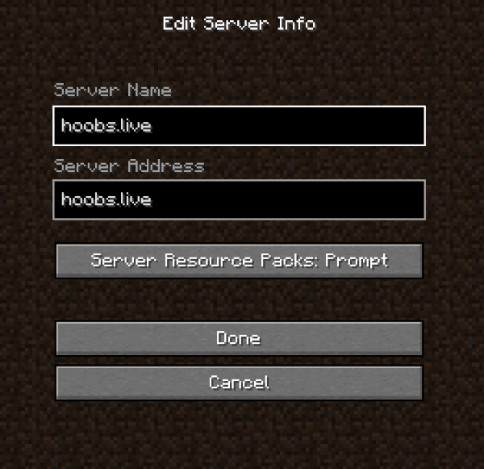
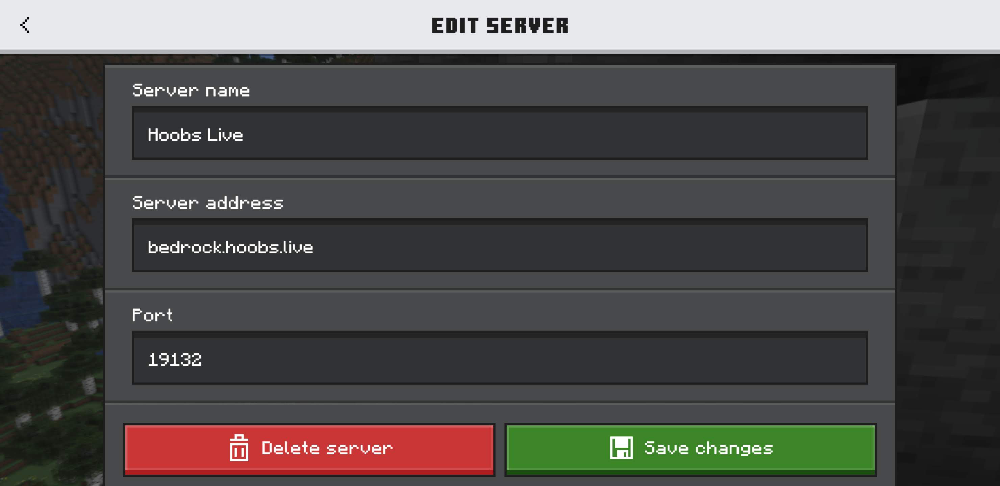

# How To Join The Server

## JAVA Edition

* Open **Minecraft Java Edition** for Windows/MacOS/Linux.
> Note: We generally try to keep the server running on the latest version of Minecraft. If you have trouble connecting, check our live stream for current supported version.
* Go to **MULTIPLAYER** then **ADD SERVER**.
* Enter **hoobs.live** in the server name and address box and click DONE!

## Bedrock Edition

* Open **Minecraft Bedrock Edition** on your device (Windows 10, mobile, console, etc.).
* Go to **Servers** then **Add Server**.
* Enter **bedrock.hoobs.live** as the server address.
* Enter **19132** as the port.
* Click **Save** and join!\

## Console Players

You will need to use a DNS trick to join the server from consoles.

<iframe width="560" height="315" src="https://www.youtube.com/embed/pPTwHZMJKbg" title="DNS Trick Tutorial" frameborder="0" allowfullscreen></iframe>
